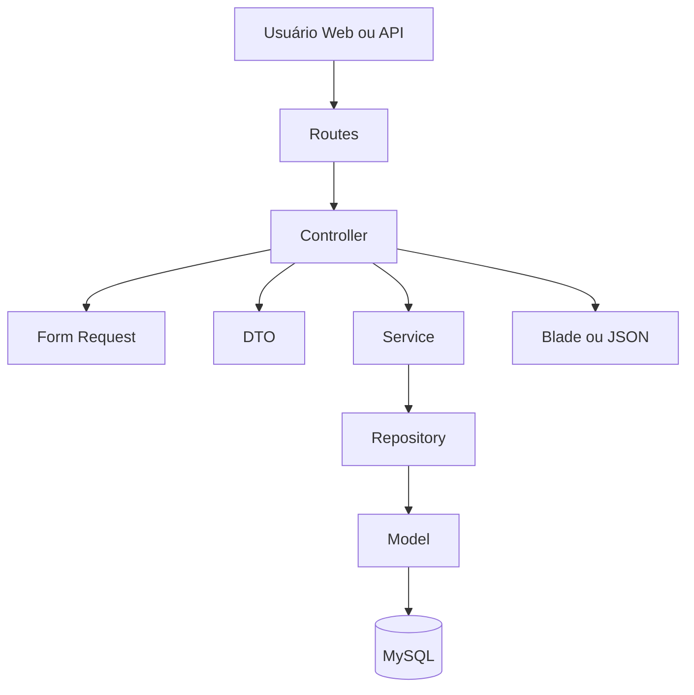
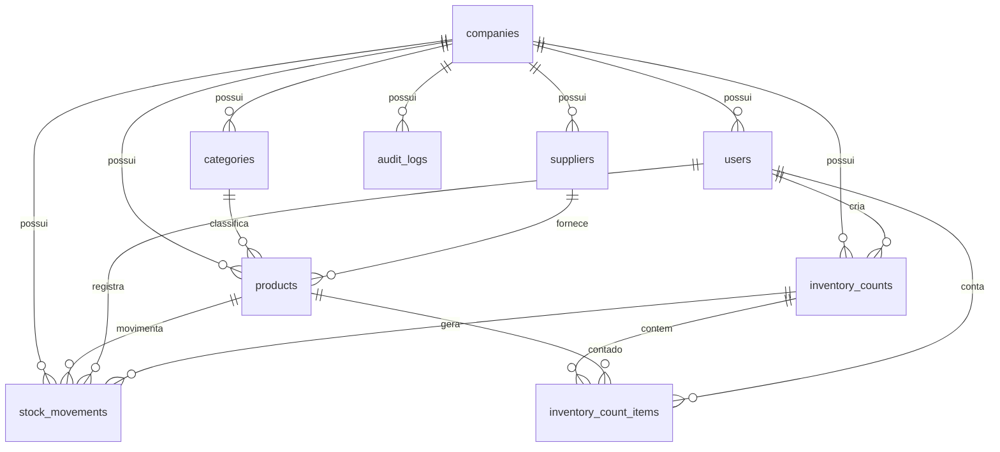
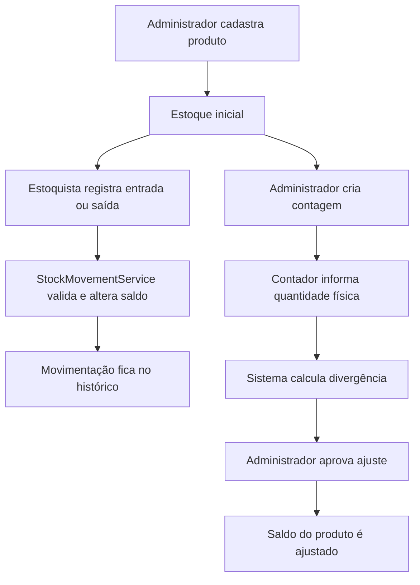

# Documento Técnico - Counter

## Nome do Projeto

Counter

## Objetivo da Solução

O Counter é um sistema web para controle, movimentação, contagem e auditoria de estoque. A solução permite que uma empresa cadastre produtos, categorias, fornecedores e usuários, registre entradas, saídas e ajustes, realize contagens físicas, acompanhe divergências e exporte relatórios.

O projeto também possui uma API REST integrada ao aplicativo Android nativo de contagem de estoque.

## Tecnologias Utilizadas

- PHP 8.2
- Laravel 12
- MySQL 8
- Blade
- Tailwind CSS
- Alpine.js
- Lucide Icons
- Laravel Sanctum
- Vite
- PHPUnit
- Composer
- npm
- Git e GitHub

## Arquitetura Adotada

O projeto utiliza MVC com arquitetura em camadas. A estrutura separa apresentação, controle de requisições, validação, transporte de dados, regras de negócio, acesso a dados e persistência.



Responsabilidades principais:

- Routes: definem URLs, middlewares e permissões.
- Controllers: recebem requisições, chamam validações, services e repositories.
- Form Requests: validam dados de entrada.
- DTOs: transportam dados estruturados entre camadas.
- Services: concentram regras de negócio.
- Repositories: concentram consultas e operações de persistência.
- Models: representam entidades e relacionamentos do banco.
- Views/API Responses: exibem telas Blade ou retornos JSON padronizados.

## Design Patterns Aplicados

### Service Layer

Usado em:

- `app/Services/StockMovementService.php`
- `app/Services/InventoryCountService.php`
- `app/Services/AuditLogService.php`

Motivo:

- Concentrar regras de negócio fora dos controllers.
- Garantir que movimentações alterem estoque com validações.
- Garantir que contagens sejam criadas, finalizadas e aprovadas com consistência.
- Registrar auditoria de operações importantes.

### Repository Pattern

Usado em:

- `app/Repositories/ProductRepository.php`
- `app/Repositories/StockMovementRepository.php`
- `app/Repositories/InventoryCountRepository.php`

Motivo:

- Isolar consultas e filtros de banco.
- Evitar repetição de queries em controllers.
- Reutilizar consultas em telas web e API.

### DTO

Usado em:

- `app/DTOs/ProductData.php`
- `app/DTOs/StockMovementData.php`
- `app/DTOs/InventoryCountData.php`

Motivo:

- Transportar dados validados de forma estruturada.
- Evitar passagem de arrays genéricos entre camadas.
- Centralizar conversão de tipos.

### Dependency Injection

Usado em:

- Controllers que recebem services e repositories por parâmetro.
- Services que recebem outras dependências pelo construtor.

Motivo:

- Reduzir acoplamento.
- Facilitar testes.
- Usar o container de dependências do Laravel.

### Facade

Usado em:

- `DB::transaction()` nos services.

Motivo:

- Garantir transações em operações críticas.
- Evitar inconsistência entre estoque, movimentações, contagens e auditoria.

## Estrutura do Banco de Dados

Tabelas principais:

- `companies`: empresas do sistema.
- `users`: usuários vinculados a empresas e perfis.
- `categories`: categorias de produtos.
- `suppliers`: fornecedores.
- `products`: produtos do estoque.
- `stock_movements`: entradas, saídas e ajustes.
- `inventory_counts`: processos de contagem física.
- `inventory_count_items`: itens contados em cada contagem.
- `audit_logs`: histórico de ações administrativas e operacionais.
- `personal_access_tokens`: tokens de autenticação da API via Sanctum.

Relacionamentos principais:

- Uma empresa possui vários usuários, produtos, categorias, fornecedores, movimentações, contagens e logs.
- Uma categoria pode possuir vários produtos.
- Um fornecedor pode possuir vários produtos.
- Um produto possui várias movimentações.
- Um usuário registra várias movimentações.
- Uma contagem possui vários itens.
- Um item de contagem pertence a um produto.
- Uma movimentação pode estar vinculada a uma contagem quando for ajuste aprovado.



## Funcionalidades Implementadas

- Login e logout web.
- Dashboard com indicadores e gráficos.
- Controle de acesso por perfil.
- Cadastro de usuários.
- Cadastro de categorias.
- Cadastro de fornecedores.
- Cadastro de produtos.
- Registro de entradas, saídas e ajustes.
- Histórico de movimentações com filtros.
- Criação de contagens de estoque.
- Atualização de itens contados.
- Finalização de contagens.
- Aprovação de ajustes.
- Listagem de divergências.
- Relatórios CSV.
- Auditoria administrativa.
- Toast global.
- Modal global de confirmação.
- Paginação padronizada.
- Loader global e skeleton.
- API REST com autenticação via Sanctum.
- Aplicativo mobile Android para contagem de estoque.

## Perfis de Acesso

| Perfil | Permissões |
| --- | --- |
| Administrador | Acesso completo a cadastros, contagens, divergências, relatórios, auditoria e aprovação de ajustes |
| Estoquista | Produtos, movimentações e relatórios operacionais |
| Contador | Contagens e sincronização de itens pela API |

## Explicação da API REST

A API foi criada para permitir integração com um aplicativo mobile de contagem de estoque. Ela utiliza Laravel Sanctum com autenticação por token Bearer.

Rotas principais:

| Método | Rota | Descrição |
| --- | --- | --- |
| `POST` | `/api/login` | Autentica usuário e retorna token |
| `POST` | `/api/logout` | Encerra token autenticado |
| `GET` | `/api/me` | Retorna usuário autenticado |
| `GET` | `/api/products` | Lista produtos paginados |
| `GET` | `/api/products/search` | Busca produtos por nome, SKU ou código de barras |
| `GET` | `/api/products/{id}` | Detalha produto |
| `GET` | `/api/mobile/summary` | Retorna resumo para o mobile |
| `GET` | `/api/inventory-counts` | Lista contagens |
| `GET` | `/api/inventory-counts/{id}` | Detalha contagem |
| `GET` | `/api/inventory-counts/{id}/items` | Lista itens da contagem |
| `POST` | `/api/inventory-counts/{id}/items` | Atualiza itens contados |
| `POST` | `/api/inventory-counts/{id}/sync` | Sincroniza itens contados |

Padrão de resposta de sucesso:

```json
{
  "success": true,
  "data": {},
  "message": "Operação realizada com sucesso"
}
```

Padrão de erro:

```json
{
  "success": false,
  "message": "Erro de validação",
  "errors": {}
}
```

## Diagrama Simplificado do Fluxo de Estoque



## Aplicativo Mobile

O aplicativo mobile foi desenvolvido em Android nativo com Kotlin, seguindo a estrutura apresentada em aula: Activity, ViewModel, Repository, DAO e Room Database.

O app consome a API REST do Laravel para autenticação, resumo mobile, listagem de contagens, listagem dos itens de contagem e sincronização das quantidades contadas. Também mantém dados localmente com Room Database, permitindo que os itens sejam salvos no dispositivo antes do envio para a API.

Fluxo principal:

1. O contador realiza login no aplicativo.
2. O app armazena o token de acesso.
3. O app consulta o resumo mobile e as contagens disponíveis.
4. O contador abre uma contagem.
5. O app carrega os itens da contagem e salva os dados localmente.
6. O contador informa a quantidade física encontrada.
7. O app salva a quantidade no Room Database.
8. O contador sincroniza os itens com a API REST.

## Prints da Aplicação

Prints usados ou recomendados para a versão final do documento:

| Tela | Arquivo sugerido |
| --- | --- |
| Login | `prints/01-login.png` |
| Dashboard | `prints/02-dashboard.png` |
| Produtos | `prints/03-produtos.png` |
| Movimentações | `prints/04-movimentacoes.png` |
| Contagens | `prints/05-contagens.png` |
| Divergências | `prints/06-divergencias.png` |
| Relatórios | `prints/07-relatorios.png` |
| Auditoria | `prints/08-auditoria.png` |
| API no cliente REST ou navegador | `prints/09-api.png` |
| Mobile - Login | `prints/10-mobile-login.png` |
| Mobile - Contagens | `prints/11-mobile-contagens.png` |
| Mobile - Itens da contagem | `prints/12-mobile-itens.png` |

## Dados de Teste

O projeto possui seeders para popular o banco com:

- Empresa demo.
- Usuários de demonstração.
- Categorias.
- Fornecedores.
- Produtos.
- Movimentações.
- Contagens.
- Itens de contagem.
- Dados para divergências e relatórios.

Usuários de demonstração:

| Perfil | E-mail | Senha |
| --- | --- | --- |
| Administrador | `admin@counter.test` | `password` |
| Estoquista | `estoquista@counter.test` | `password` |
| Contador | `contador@counter.test` | `password` |

## Dificuldades Encontradas

- Separar corretamente responsabilidades entre controller, service, repository e model.
- Garantir que a quantidade de estoque fosse alterada somente por movimentações ou ajustes aprovados.
- Criar uma interface consistente com componentes globais de toast, modal, paginação e loaders.
- Padronizar respostas da API para facilitar a integração com o aplicativo Android.
- Manter isolamento por empresa para evitar acesso a dados indevidos.
- Criar dados de teste suficientes para demonstrar o sistema.

## Roteiro Sugerido de Apresentação

Tempo sugerido: 5 a 10 minutos.

1. Apresentar o objetivo do Counter.
2. Mostrar login e perfis de acesso.
3. Demonstrar dashboard.
4. Demonstrar cadastro de produto.
5. Demonstrar movimentação de estoque.
6. Demonstrar contagem e divergência.
7. Demonstrar aprovação de ajuste.
8. Mostrar relatório CSV.
9. Mostrar rapidamente a API REST.
10. Demonstrar o aplicativo Android.
11. Explicar arquitetura e Design Patterns no código.

## Verificações de Qualidade

Comandos usados para validar o projeto:

```powershell
php artisan test
npm run build
composer audit
npm audit --audit-level=critical
git diff --check
```

```powershell
cd mobile
.\gradlew.bat assembleDebug
```

Também são verificadas possíveis falhas de encoding, caracteres invisíveis e acentuação em português nos textos visíveis ao usuário.
